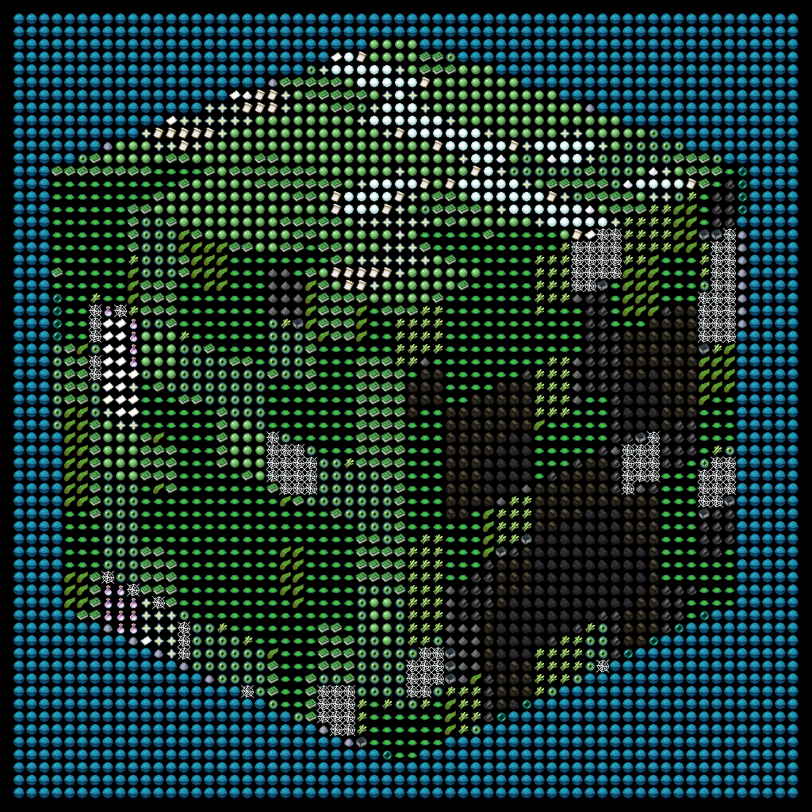

# MinecraftImageBundle
Convert images to mc bundles! :)

pip install -r requirements.txt

example usage:
python main.py -f lobster.png -s 32x32 -p other --preview --dither -d 50

-f lobster.png: load file "lobster.png" 

-s 32x32: set bundle size for 32x32 (items)

-p other: operate on the palette "other"

--preview: save a preview of what to expect ingame

--dither: Enable dithering

-d: Set quantitative error deviation limit
    This will divide the cumulated error in half if the deviation is past this number
    Without this, most images will not work, and the error in mapping to the pallete
    will propagate through the rest of the image
    This can work with values anywhere from 0.1 to 100

Dithering is best suited for images with a lot of varying detail, or faces
Dithering is not recommended for images smaller than 48x48
Dithering will make the image take substantially longer to process; often 5 times longer!

other sizes and palettes are available, this even supports texturepacks
just make a collection of the item images and their id's ingame, and make a new folder under "palettes"

